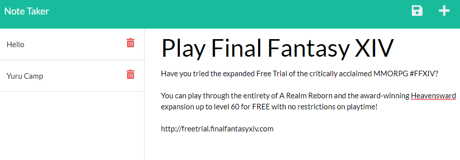

# Note Taker

[Click here to visit the app](https://note-taker-lh19072021.herokuapp.com/)

Create and save notes to be viewed later with the note taker app!

---

## Usage

- Click on the text area on the right-hand side to write a note. 

- Save a note with the save icon in the upper right hand corner. 

- Open an existing note by clicking on it on the left panel. 

- Click on the plus sign to create a new note. 

- Delete a note by clicking on the trash can icon.

---

## Installation

[Click here to visit the app](https://note-taker-lh19072021.herokuapp.com/)

1. Clone the repo or download the code as a zip.
   
    `git clone https://github.com/LemonPocky/note-taker.git`

2. If downloaded as zip, unzip the contents. Place the folder in an easily accessible location on your computer.
   
3. Navigate to the root folder using the terminal or other command-line interface.

4. Run the following commands:
   
   `npm install`

   `node server.js`

    a. Change the server port to something other than 3000 if desired in server.js.
5. The server is running when you see the following message in console: 
   
   `Server is listening on port <PORT>`

6. Visit the page at http://localhost:\<PORT> .

